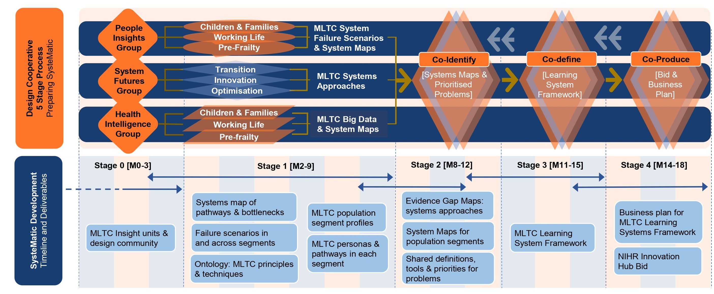

# Structure of the commons

## Development stage design process 
We adopt a design cooperative approach for MLTC systems change.
 
 [Read our protocol paper published in the Journal of Multimorbidity and Comorbidity here](https://journals.sagepub.com/doi/10.1177/26335565241272682)

## Structure of the commons  
This site is a living resource, meaning the content is constantly being updated, revised and refined. At present, the site is organised according to the design co-operative approach we are adopting during the development phase. The navigation bar from left to right approximately follows the stages of the SysteMatic project as outlined below.

 
 
**Stage 0: Convene the Design Cooperative:** 

  
-  :material-cards-diamond: __About SysteMatic__

    ---
    
    Find information about SysteMatic's design co-operative approach, including its principles and evolving processes

    [:octicons-arrow-right-24:](about.md)

 
**Stage 1: Deep Dives into MLTC Epidemiology, Experiences and Services:**

  
-  :octicons-graph-24: __Health Intelligence (Quantitative data)__

    ---
  
    Find information, updates and resources from the Health Intelligence group around the use of health and civic data to understand and improve MLTC systems 

    [:octicons-arrow-right-24:](health-intelligence/health-intelligence-overview.md)

-  :octicons-person-16: __People Insights (Qualitative data)__

    ---
  
    Find information, updates and resources from the People Insights group around the use of design, social sciences and arts-based participatory approaches to understand and improve MLTC systems 

    [:octicons-arrow-right-24:](people-insight/people-insight-overview.md)
    
-  :material-vector-circle: __Systems Science__

    ---

    Find information, updates and resources from the Systems Futures group about the application of systems science to MLTC

    [:octicons-arrow-right-24:](systems-science/systems-science-overview.md)

 
**Stage 2: Co-identify Priority MLTC Systems Failures and Targets for Action,** 
**Stage 3: Co-define Research, Technology and Intervention Priorities,** 
**Stage 4: Co-producing the SysteMatic MLTC Innovation Hub Business Plan:**

-  :material-flag-triangle: __Collective Synthesis & Outcomes__

    ---

    Find out about bringing together disciplines and stakeholders to co-define and co-prioritise problems in MLTC systems

    [:octicons-arrow-right-24:](collective-outcomes/collective-outcomes-overview.md)
  

