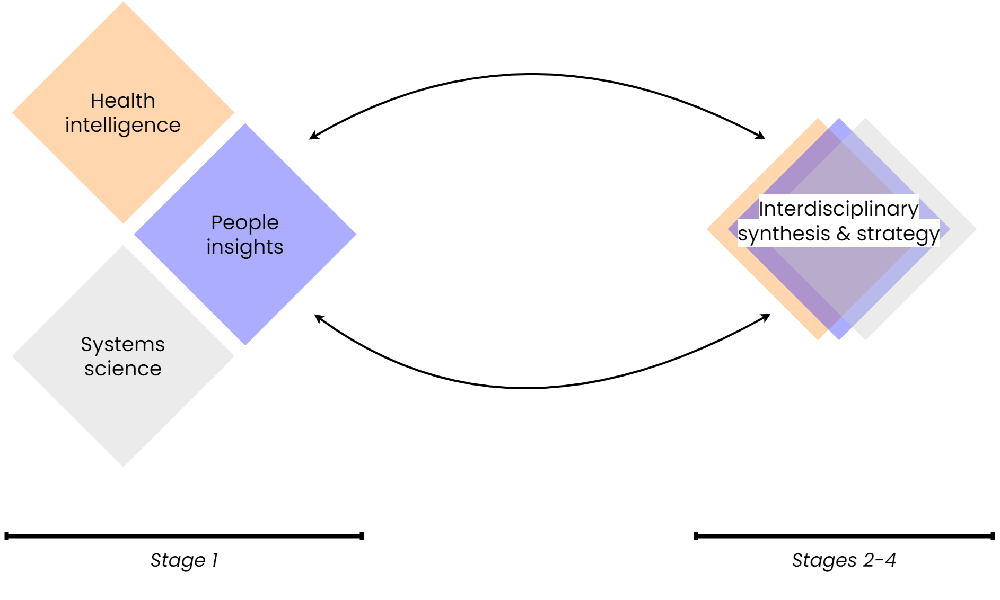

---
hide:
- toc
---

# Navigating the commons

This site is a living resource, which we are adding to throughout the development process, meaning the content is constantly being updated, revised and refined. 

## Site structure
At present, the site is organised according to the process we are adopting during the development phase.
 

| Project Stage                                                       | Section of the Commons                                                                                                       |
| ------------------------------------------------------------------- | ---------------------------------------------------------------------------------------------------------------------------- |
| Stage 0: Convene the design cooperative                             | About SysteMatic [:octicons-arrow-right-24:](about.md)                                              |
| Stage 1: Deep dives                                                 | Health Intelligence (Quantitative data) [:octicons-arrow-right-24:](health-intelligence/health-intelligence-overview.md) People Insights (Qualitative data) [:octicons-arrow-right-24:](people-insight/people-insight-overview.md) Systems Science [:octicons-arrow-right-24:](systems-science/systems-science-overview.md) |
| Stage 2: Co-identify problems & priorities   Stage 3: Co-define visions & targets   Stage 4: Co-produce business plan    | Transdisciplinary Synthesis & Strategy [:octicons-arrow-right-24:](collective-outcomes/collective-outcomes-overview.md)    |

 
{ width=750 }

## Tags
Resources in the commons are assigned tags according to categories such as project stage and resource type. 
  **[Browse the tag index here](../tags.md).** 

