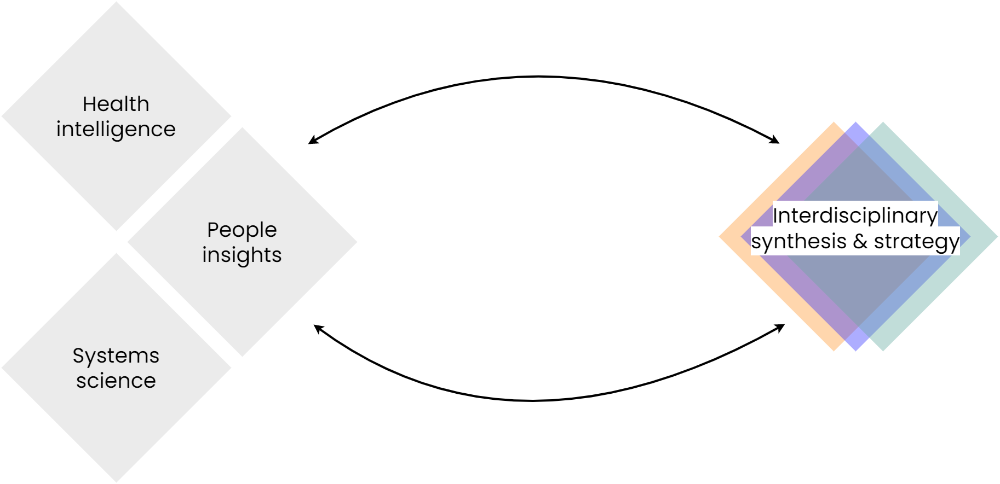

# Transdisciplinary synthesis & strategy

 This section contains resources about bringing together multiple disciplines and stakeholders to synthesise qualitative and quantitative data insights and develop strategies for MLTC systems change.
