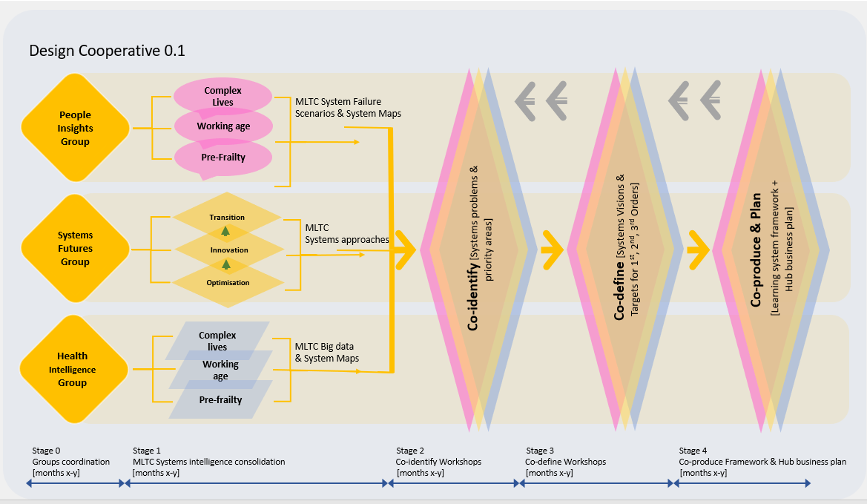

---
hide:
  - toc
---

# Overview
We are designing SysteMatic through three working groups studying [**systems**](docs/design-cooperative/systems-futures.md), [**people**](docs/design-cooperative/people-insights.md) and [**intelligence**](docs/design-cooperative/health-intelligence.md), in a cooperative of people and disciplines including: those with lived and caring experience of MLTC, health and care professionals, scientists, engineers, designers, artists and social scientists.

