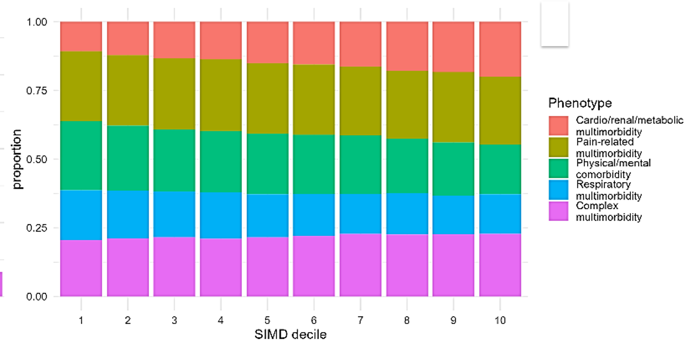

---
hide:
- toc
tags:
- Stage 1
- Quantitative population intelligence
---

# Primary care data - Liverpool

## Methods

## Findings 

/// caption
Most common phenotypes (number of people affected)
///

 

/// caption
Differences in multimorbidity phenotypes by SIMD decile by proportion 
///
