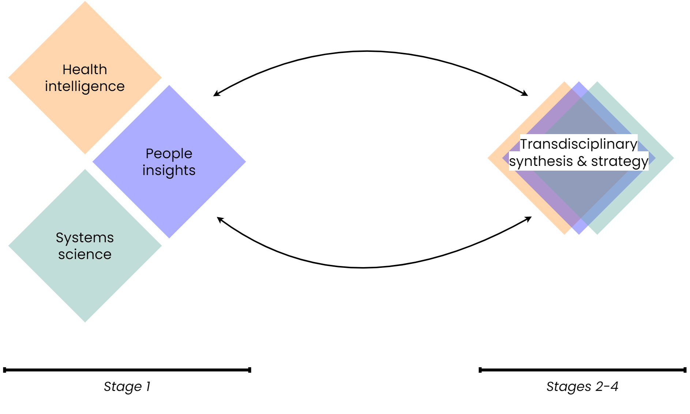

---
hide:
  - navigation
  - toc
---

# Welcome to the SysteMatic Digital Commons

**What is the SysteMatic Digital Commons?**  

- A place to share outcomes and updates from the SysteMatic project. This includes resources (methods, tools, models, reports & more) focused on applying systems engineering to improve health and care for people living with Multiple Long-Term Conditions (MLTC) equitably. 
- The goal is to support collaboration, conversation and learning about systems approaches for MLTC.
- This site is a living resource, which means the content is constantly being updated, revised, and refined.

 

**Who is it for?**  
Our resources are primarily aimed at academic researchers and professionals who are interested in systems approaches for MLTC.  

All of the material in the SysteMatic Digital Commons is available through a [Creative Commons Attribution 4.0 International](https://creativecommons.org/licenses/by/4.0/) (CC BY 4.0) license. 

 

**Navigating the commons**  
At present, the site is organised according to the process adopted during the [SysteMatic development phase](about-systematic/development-stage.md).

 

{ width=750 }

 

| Project Stage                                                       | Section of the Commons                                                                                                       |
| ------------------------------------------------------------------- | ---------------------------------------------------------------------------------------------------------------------------- |
| Stage 0: Convene the design cooperative                             | About SysteMatic [:octicons-arrow-right-24:](about.md)                                              |
| Stage 1: Deep dives                                                 | Health Intelligence (Quantitative data) [:octicons-arrow-right-24:](health-intelligence/health-intelligence-overview.md) People Insights (Qualitative data) [:octicons-arrow-right-24:](people-insight/people-insight-overview.md) Systems Science [:octicons-arrow-right-24:](systems-science/systems-science-overview.md) |
| Stage 2: Co-identify problems & priorities   Stage 3: Co-define visions & targets   Stage 4: Co-produce business plan    | Transdisciplinary Synthesis & Strategy [:octicons-arrow-right-24:](collective-outcomes/collective-outcomes-overview.md)    |

 

**Tags**  
Resources in the commons are assigned tags according to categories such as project stage and resource type.  
**[Browse the tag index here](../tags.md).** 

 
 
 

{: style="transform: scale(0.7);"}
