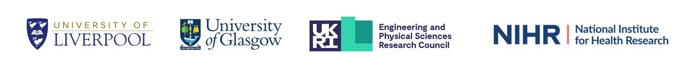

---
hide:
  - navigation
  - toc
---

# Welcome to the SysteMatic Digital Commons

**What is the SysteMatic Digital Commons?**  

- A place to share outcomes and updates from the SysteMatic project. This includes resources (methods, tools, models, reports & more) focused on applying systems engineering to improve health and care for people living with Multiple Long-Term Conditions (MLTC) equitably. 
- The goal is to support collaboration, conversation and learning about systems approaches for MLTC.
- This site is a living resource, which means the content is constantly being updated, revised, and refined.

 

**Who is it for?**  
Our resources are primarily aimed at academic researchers and professionals who are interested in systems approaches for MLTC.  
 
All of the material in the SysteMatic Digital Commons is available through a [Creative Commons Attribution 4.0 International](https://creativecommons.org/licenses/by/4.0/) (CC BY 4.0) license. 

 

