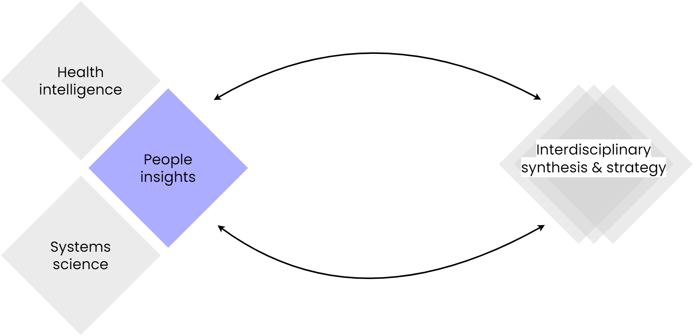

# People insights

{ width=700 }

  **People insights** involves the capture and synthesis of perspectives from a diversity of patients, practitioners, and public partners about MLTC systems. It draws upon advanced methods in inclusive, human-centred and systemic participatory design, as well as and arts- and social sciences-based methods.

The structure of People Insights section aims to reflect a nuanced approach to understanding diverse perspectives within MLTC systems. While the catch-all term PPIE is commonly used in health research, we intentionally distinguish between patient and public involvement, acknowledging that each has distinct knowledge, experiences, needs and desires, and their involvement in research serves different purposes and requires different approaches. 

We cover 3 levels of magnitude for comprehensive understanding of: individual lived experience (person), pathways and interactions (journey), and systemic interdependancies (system). 

Finally, we share metaphors and images, which distil complex experiences of MLTC into accessible, creative forms. 

