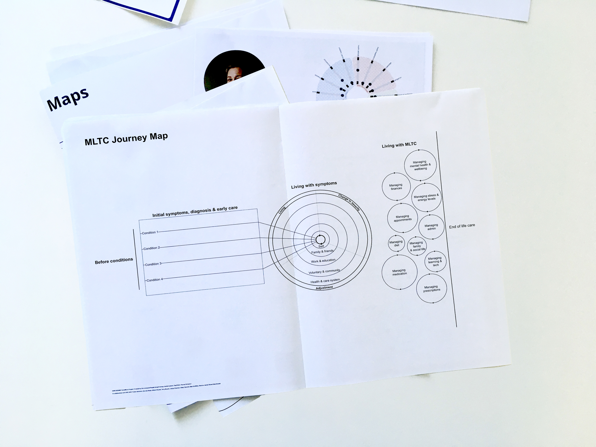

---
hide:
- toc
tags:
- Stage 1
- Models, frameworks & strategies
- Methods & tools
---

# MLTC journey mapping

/// caption
MLTC journey mapping template.
///
  
:material-download: [MLTC journey mapping template](../assets/journey-map-template.pdf){target="_blank"}

## Overview

Journeys are an important concept in service design discourse.[^1] Several methods arise from service design methods that are particularly focused on the user journey, e.g. service design blueprint, and customer journey …[^2] A journey map is focused on the changes in a user’s experience throughout a process and could be used to map different touchpoints of a service and which kind of visible / invisible systems affect the user’s experience. 

## Application & use

As a conceptual model, journeys are also used in the context of health systems, whereas the concept of service users may not be applicable to many health and care-related experiences. Two distinctive models, one from NHS Digitals researchers[^3] and one from the Future Health and Wellbeing Research Group[^4], served as a base for the journey map. 

The journey map for the SysteMatic especially differs in the way that it allows multiple health conditions to be mapped. Three separate steps were identified through interviews with people’s lived experiences and literature research: the journey before health conditions, the diagnosis and managing health conditions and life. 

Several iterations of the journey map were developed with feedback from people with lived experience, public advisors and health professionals. 

## Results & insights

Journey maps were used during some of the interviews with people living with multiple health conditions and healthcare professionals to understand pain points of the journeys. They are also used to visualise different health stories and communicate these with stakeholders, for example, during project workshops. 

Visualising people’s health journeys on the journey maps allows the researchers to identify similar or distinctive patterns of interacting with the health system. The journey maps also allow stakeholders to understand the burden of managing health conditions besides other aspects of life which are affected by these. 

## References

[^1]:
  Stickdorn, M., Schneider, J. (2012). This Service Design Thinking: Basics – Tools – Cases. BIS Publishers. 
[^2]:
  Nielsen Norman Group. (n.d). Journey. [https://www.nngroup.com/search/?q=journey](https://www.nngroup.com/search/?q=journey){target="_blank"}
[^3]:
  Väänänen, T. (2019). Mapping Health & care. [https://medium.com/@teropsv/mapping-health-care-4e8681b6b64d](https://medium.com/@teropsv/mapping-health-care-4e8681b6b64d){target="_blank"}
[^4]:
  Future Health and Wellbeing. The modern outpatient. [https://futurehealthandwellbeing.org/modern-outpatients](https://futurehealthandwellbeing.org/modern-outpatients){target="_blank"}
  

