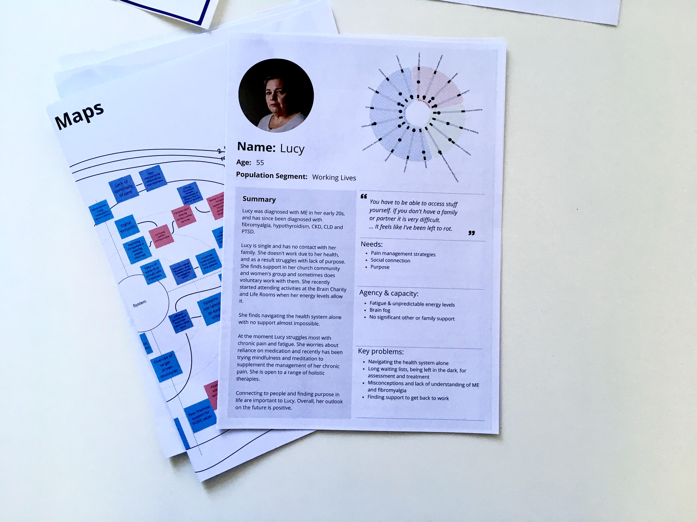

---
hide:
- toc
tags:
- Stage 1
- Models, frameworks & strategies
- Methods & tools
- Video
---

# MLTC Person maps

/// caption
Example person map used Liverpool Stage 2 workshop.
///

## Overview

Person maps are a tool to develop rich understanding of people with MLTC, including their needs, goals and behaviours. Extending beyond conventional persona representations, which are criticised for stereotyping, bias and being reductive,[^1][^2][^3] the maps integrate systemic and contextual factors, emphasising how individuals’ experiences are shaped by a) their interactions with others (households, communities, clinicians); b) their journeys through the healthcare system; and c) the broader context of their lives. Incorporating Inclusive Design principles, the maps represent a diversity of mainstream and extreme users, scenarios and contexts.[^4] 

## Application & use

The Person map template used for SysteMatic was informed by data from activity books, interviews and focus groups with people with MLTC, and designed and developed  in collaboration with public advisors and system stakeholders (from health and VCSFE sector). The person maps are to be viewed a work in progress – open to continual development and adaptation for different situations depending on the level of detail appropriate. The maps are currently booklets, split into three main sections, capturing information across personhood (e.g., socioeconomic status), health (e.g., complex co-occurring conditions), and patienthood (e.g., navigation and trust in or avoidance of healthcare systems). 

## Results & insights

The Person maps provide rich insights about people with MLTC. We think that this is important alongside the population level data that is typically used to understand and make decisions about MLTC. By adopting an equity lens, Person maps enable stakeholders to move beyond generic representations, and consider a range of people with MLTC – particularly those at the ‘extremes’.  Person maps should be contextual and co-produced within the project context - rather than using a standard template.

Public advisor, Ali, shares her perspective on the Person maps

  

    <iframe src="https://www.youtube.com/embed/v=XKiM1-K0pss" frameborder="0" allowfullscreen style="position:absolute;top:0;left:0;width:100%;height:100%;"></iframe>
  

## References

[^1]: 
    Cutting, K. Hedenborg, E. (2019). Can personas speak? Biopolitics in design processes. In Companion Publication of the 2019 on Designing Interactive Systems Conference 2019.
[^2]:
    Chapman, C. & Milham, R. (2006). The personas’ new clothes: Methodological and practical arguments against a popular method. Proceedings of the Human Factors and Egonomics Society Annual Meeting. 
[^3]:
    Price, M. (2019). Kill your personas. [https://medium.com/microsoft-design/kill-your-personas-1c332d4908cc](https://medium.com/microsoft-design/kill-your-personas-1c332d4908cc){target="_blank"}
[^4]:
    Nickpour, F. Shaw, C. Leason, I. Tibbles, A. Kille-Speckter L. (2024) Critical Inclusive Design. Design for All. [https://www.researchgate.net/publication/378071679_Design_for_All_-_Critical_Inclusive_Design](https://www.researchgate.net/publication/378071679_Design_for_All_-_Critical_Inclusive_Design){target="_blank"}

