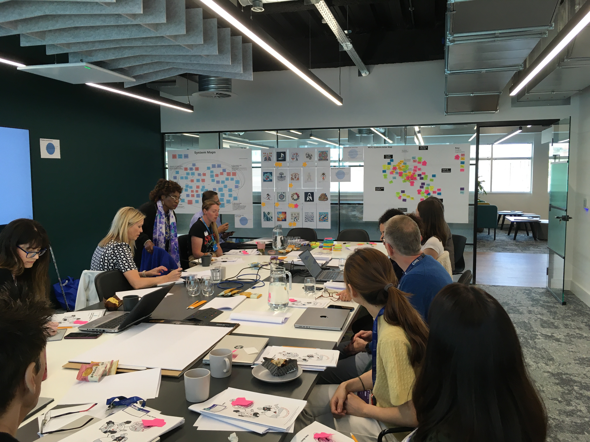
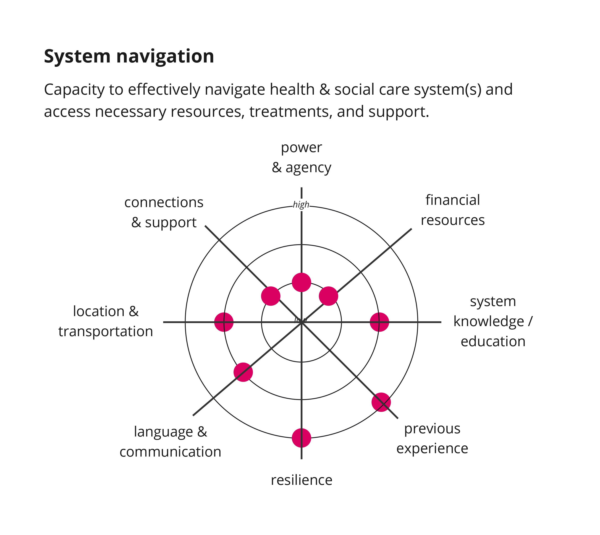

---
hide:
- toc
tags:
- Blog
---

# A PPIE perspective on involvement in SysteMatic
*by Ali Bryant*

/// caption
Liverpool Stage 2 workshop; bringing together health and care professionals, Cheshire & Merseyside ICB, academics and the PPIE group to define problems and priorities for MLTC systems. 
///

Grounding the SysteMatic project with lived experience and adapting and shaping the work through the lifespan for me as a PPIE member has been a very rewarding process validating my involvement. The Patient Public Involvement and Engagement- PPIE group consists of seven members of the public, representing a range of diversity and intersectionality, all members having lived experience of Multiple Long-Term Conditions-MLTC’s. Our role has been (and is) to support the development of SysteMatic with our expertise to define and refine the content which we have all witnessed has changed and evolved over time in response to our input. The PPIE group and I have considered how integral we are to the work and to the process and this is evidenced from our regular meetings,  in witnessing the material changes and adaptations  that result with detailed feedback from the team plus the support we are given with adjustments made if required to contribute and the opportunities we have to showcase our involvement– including writing this blog!! It is so important to reflect on the value of our involvement as part of the process partly to ensure that projects and research really reflect and are grounded and influenced by PPIE input, perspective and knowledge but also to evaluate how we are valued as members of the team and certainly SysteMatic in my experience is an exemplar of PPIE best practice. 

/// caption
PPIE involvement in the SysteMatic activity book design and development process. 
///

In the development stages of SysteMatic, the PPIE group were selected after providing expressions of interest on our lived experience of multiple long-term conditions or holding a MLTC carer identity. The expressions of interest also expressed our passion in using our lived experience to effect system change for a better future, and our broad knowledge of how the system impacts us as service users with MLTC’s. This level of insight has made SysteMatic stronger in development being shaped by our understanding of the system to innovate around and highlight what the pinch-points are that make living with MLTCs so difficult to manage and navigate. I have seen how my voice and the contributions of the group have altered SysteMatic from the get-go. We have contributed to ethics approval, the pilot work particularly the various iterations of the person map, ongoing discussion at each phase discussing what worked or didn’t or could be reframed. Designing the system maps and getting creative with post-it notes to highlight the areas of strength and discuss areas which overlapped or needed further consideration. Whether in workshops or sandpit events with stakeholders we have been able to share our views in coproduction alongside healthcare professionals and academics/researchers to explain and help to steer the direction SysteMatic has taken to be the best version of itself. 

I asked the PPIE group to share their thoughts on how they view their impact and involvement in SysteMatic and to consider interactions they have had where they have observed shifts and changes:

!!! quote "Hilary Garrett, PPIE Lead SysteMatic"
    
    From the exciting early stages of the first bid submission I felt I had a genuine impact on shaping the proposal. I feel my voice was valued from the outset and has continued to be heard at every stage of the process      to date. It has been great to help to pull together and be part of this enthusiastic and talented team of public contributors. Together they represent a great many years' worth of lived experience. In addition, I have     benefited enormously in participating in Systematic not least because of my greater clarity about where the study fits in moving forward the agenda of equity in health across the healthcare research landscape for          those of us with MLTCs.

/// caption
PPIE lead, Hilary, speaking at the Liverpool sandpit event.
///

!!! quote "Patricia Jamal, PPIE SysteMatic"

    This project came to me at the right time… I have had a number of experiences as a public contributor and as one who is living with Multiple Long-Term Conditions, so I felt ready to contribute with quality and             effectiveness. I thoroughly enjoyed working with such a diverse and knowledgeable set of individuals, each bringing their unique contribution, and learning from each other through the process. Throughout the diverse       discussions we’ve had over the last few months, I felt valued, listened to and my thoughts taken into consideration. It is obvious that PPIE is taken very seriously and indeed very much looked for as a means to            enhance the research process

!!! quote "Terry Bryant, PPIE SysteMatic"

    The Systematic project is intriguing in many ways. Not only is it a fresh and insightful approach to qualifying and quantifying the healthcare landscape for people with multiple long-term conditions, but from the      
    outset the project has meaningfully and substantively engaged with public contributors. Well-managed meetings where the 'public voice' is valued and listened to creates a genuinely collaborative and positive               environment. For me, what Systematic also, and most importantly, offers is the real prospect of improving healthcare provision by aiding both healthcare professionals and patients. 

It is powerful and empowering for me to read these reflections as they illustrate so clearly why projects and research must embed lived experience to generate meaningful change. My own example to share is an email I sent and the subsequent feedback I received from the Systematic team which resulted in an identifiable change to SysteMatic. I had been reflecting specifically on system pinch-points which I felt needed addressing within the person and system map with more emphasis: “There is a person cost re time/access for MLTC, potential barriers re bad days, loss of appointments/place on waiting lists and having to be re-referred with more time on waiting lists which can all adversely impact health, hope and quality of life. Equally there are system costs with missed appointments/more investment re worsening health over waiting times which innovation could support with online consultations/appointments (I know there are tech barriers and digital poverty). Tests conducted at local hubs have ecological benefits to the carbon footprint for all, so through reducing the impact of patient commutes to distant services when local community appointments could achieve better patient experience is necessary. Many of my consultant appointments do not require F2F so could be triaged with that in mind with bloods/weight managed prior to appointments in local settings to have results in real time for virtual consultations. Another factor is distress around long clinic waiting times which in my case lead to increased anxiety, depression and concern growing exponentially with long waits post consultation for more or repeat tests to be set up and the results shared. More local and online options would allow additional benefits with space freed up in the system to speed up access to those on referral for first appointments to be triaged on fast track.”

The response to my feedback and reflection from the team was really positive and generated a change which is now present in the current iteration of SysteMatic, and I was told, “I think it’s an important point re location of treatment and barriers around travel and transport. It came up in the journey maps and system maps” As a result an extra dimension called ‘transportation & geographical location’ was added to the person map and is linked to ‘system navigation’ on the last page.  Further to this and validating my contribution and knowledge I was informed, “Happy to hear your thoughts and suggestions on incorporating into the person map for evolving and updating the materials. Your point is really relevant to some of the ongoing discussions around work packages and projects. I will add some notes from what you’ve said to the relevant documents so that people working on those work packages and projects can see them.” I think this example illustrates the dynamic at work in Systematic where the research/development team and PPIE are not separate entities but are integrated as working colleagues in the development of SysteMatic.  

/// caption
'System navigation' section of the person maps, including the updated 'location and transportation element'.
///

I hope this blog has allowed you to understand more about PPIE in SysteMatic and the benefits of PPIE in projects and research (if this is new to you). Also, how reflecting on involvement can reveal overtly the interactions where our PPIE insight and knowledge has impacted directly on the work or adaptations which have increased the utility and benefit of the output. Alongside this also important to consider is how has PPIE involvement been viewed and embedded by the team to be successfully integrated or conversely not!!? Within SysteMatic I am happy to share the PPIE group are considered as lived experience researchers working in coproduction as valued team members but sadly within research this is not always the case and best practice is not demonstrated. If reading this blog has given you pause for thought as a researcher to think about PPIE and how you engage this aspect within your projects or if you are a PPIE member I invite you to please reflect on that involvement to shape and influenced research grounded with that lens.

    
